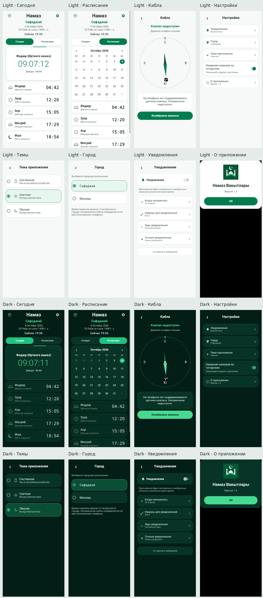
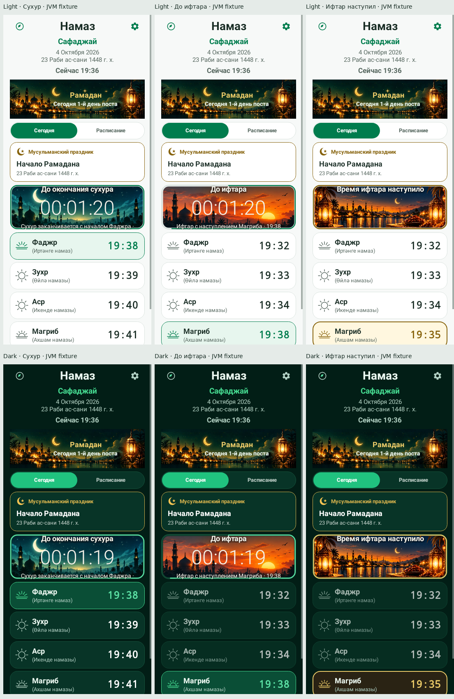
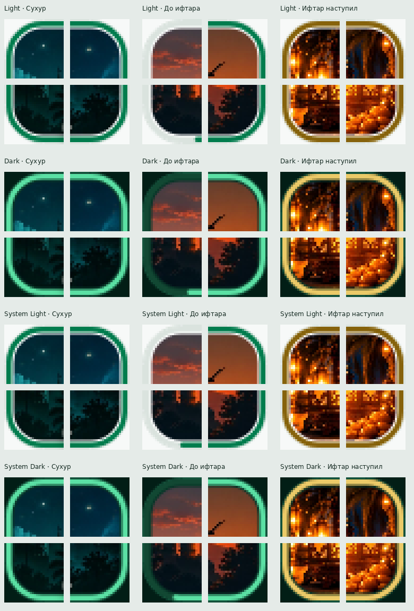

# Перенос тем и Ramadan UI в stable — 4 октября 2026

## Две отдельные операции

1. Тестовая ветка `test/1.2-test3-security`: commit `282c611fb77a67dfb80a77829f88795c483c4cbb`. Менялись только `MainActivity.kt` и `ThemeAndRamadanTest.kt`: подписи времени и дня поста приведены к обычному формату. Видимые тестовые пометки удалены. Debug fixture, искусственное начало поста, подмена времени и четыре сцены (до периода, сухур, ожидание ифтара, наступивший ифтар) сохранены. Debug APK собран; 79 debug и 79 release unit tests, lint без ошибок, preflight и 7 security tests прошли.
2. Production подготовлен отдельно от актуального `main` (`e7bd190522b5c7b149a7c25d127b6e4c0182907a`). Слепого merge/cherry-pick всей тестовой ветки нет. Production commit имеет только актуальный main в качестве родителя. GitHub отклонил прямую запись в main: активный ruleset требует Pull Request и пять обязательных status checks. Защита не менялась и не обходилась. Для прохождения установленного процесса используется отдельная production-ветка `production/themes-remote-ramadan` и PR, содержащий только выборочно подготовленный diff. Тестовая ветка целиком не объединяется.

## Темы

`AppTheme.kt` содержит System/Light/Dark и семантическую палитру. Dark сохраняет прежние цвета; Light использует нейтральный фон, белые поверхности, тёмный/серый текст и фирменный зелёный. Общая геометрия экранов сохранена. Настройка записывает только `app_theme` в существующие SharedPreferences `settings`; город, уведомления, звуки и татарские названия не сбрасываются. Новая установка выбирает System. System читает Android UI_MODE_NIGHT и корректно пересоздаёт экран при смене конфигурации.

В существующем полноэкранном settings panel добавлен выбор темы с тремя radio rows и подписями. Иконки — vector drawable: смартфон, контурное солнце, контурный полумесяц. Монитор и emoji не используются. Палитра применяется к основным экранам, календарю, Кибле, компасу, настройкам, диалогам и системным панелям. Отдельного bottom sheet UI в проекте нет: используются существующие Dialog/panel.

## Ramadan artwork и clipping

| UI | Drawable |
|---|---|
| Постоянный banner | `R.drawable.ramadan_header` |
| Сухур | `R.drawable.ramadan_suhoor` |
| Ожидание ифтара | `R.drawable.ramadan_iftar` |
| Наступивший ифтар | `R.drawable.ramadan_iftar_started` |

Один и тот же набор изображений используется в Light/Dark/System. Финальный `ramadan_iftar_started.webp` взят из пользовательского commit `0f1cba34fae7307a8eab67d8d17290f9a0445472` без resize, сжатия или повторного сохранения: **1983×793**, **334112 bytes**, SHA-256 `30840961c774cd6099d98069984ab1b15feef4c296483f272272f335e950a947`. Оригинальные баннер, сухур и закат совпадают с main побайтно. Дополнительных Light/Dark bitmap-копий нет.

Только наступивший ифтар использует центрированный `CENTER_CROP` с одинаковым масштабом обеих осей. Сухур и ожидание ифтара сохраняют прежний `FIT_CENTER`. Заголовок рисуется UI, белый цвет и тень сохранены; мечеть/полумесяц остаются ниже надписи. Размер карточки и расположение текста не менялись.

`RamadanCountdownImageView` выполняет `Canvas.clipPath` внутри stroke: inset 3.5dp, внутренний радиус 14.5dp и запас 1 физический пиксель для anti-aliasing. Golden/progress stroke рисуется поверх artwork. В `CardProgressIndicator` перенесены только ссылки на проверенную тематическую палитру: расчёт прогресса, направление, path, толщина, форма и связь со временем сохранены.

## Production-календарь

Из `HolidayCalendar.items` удалены две встроенные записи начала поста и Ураза-байрама. Остальные семь встроенных праздников сохранены. Другие hardcoded Ramadan-даты не добавлялись.

`ramadanDay()` обращается исключительно к `remoteByYear[date.year]`. Для расчёта нужны оба удалённых события: начало поста и Ураза-байрам. Границы — включительно начало и исключительно конец; номер дня вычисляется разницей civil dates + 1. Нет списка или любой одной границы — возвращается null, Ramadan UI отсутствует. Изменение дат в валидных remote holiday-данных применяется без нового APK.

Существующий путь остаётся неизменным: manifest → year holiday JSON → path/schema/size/SHA-256/JSON проверки → private AtomicFile snapshot → повторная проверка cache → `setRemote()` → `ramadanDay()`. HolidayRepository, ScheduleRepository, RemoteJson, RemoteTransport и SignedManifestVerifier побайтно сохранены из актуального main. При неудачном обновлении сохраняется предыдущий проверенный cache; если подтверждённых дат нет, пост не активируется.

## Отсутствие preview в stable

Ни в main, ни в debug/release runtime source sets нет preview-классов, test date/time overrides, UI меню проверки, ручных сцен или принудительного дня поста. `UiPreviewScene.kt`, обе реализации `RamadanUiPreview.kt` и меню из тестовой ветки вообще не переносились.

Поиск всех запрошенных markers выполнен в Kotlin/Java/XML/Gradle, helpers, tests, fixtures, scripts и документации. В runtime «Тест UI», «Проверка Рамадана», TEST_RAMADAN, artificial date и artificial scene times отсутствуют. Совпадения даты обычного августовского дня и времён в PrayerDay оставлены: это исходные данные расписания, а не override. Февральская/мартовская даты встречаются только в JVM mocks для remote validation и исторических материалах, не в production fallback. Отрицательные assertions в tests/security scripts намеренно содержат запрещённые markers. JVM test fixtures не входят в APK.

Новые guard tests проверяют все runtime source sets. `check-apk-contents.py` дополнен поиском preview names/UI strings в UTF-8 и UTF-16LE. Проверен собранный debug APK: preview classes/strings отсутствуют, финальный bitmap содержится один раз и совпадает с оригиналом побайтно.

## Проверки

- `assembleDebug`: PASS. Release Kotlin/Java/resources/Dex tasks компилируются.
- Unit tests: **123 debug + 123 release**, 0 failures/errors/skipped.
- Lint debug/release: **0 errors / 62 warnings** в каждом варианте; проверки и suppression не ослаблялись.
- Preflight: PASS, все **1530 встроенных времён** двух городов неизменны.
- Python security/signing/production tests: **17/17 PASS**.
- Repository security scan/history guard: PASS.
- Merged release manifest audit: PASS (backup/device-transfer exclusions, permissions, non-exported components, cleartext policy, stable identity).
- `assembleRelease`: штатно остановлен `verifyReleaseSigning`, поскольку локально отсутствуют четыре protected signing inputs. Защита не обходилась, unsigned/debug-key release не создавался. Подписанный APK и проверка pinned stable certificate должны выполняться существующим ручным workflow с `environment: stable-signing`; workflow в этой сессии не запускался.
- Физического устройства/эмулятора нет: instrumentation и установка поверх stable не выполнялись. Native UI отрисовка — Robolectric API 33. Цвет темы DatePicker проверен автоматически; полный native render системного DatePicker ограничен Robolectric framework, не считается device QA.

Новые production-тесты охватывают System Light/Dark, forced themes, переключение Android configuration, restart, сохранение всех существующих preferences, selector, Light/Dark/System основные экраны, dialog theme и контраст. На проверенных unit-test remote входах выполнены все 12 комбинаций Ramadan artwork (3 состояния × 4 конфигурации). Проверены все 48 углов и alpha каждого пикселя вне внутреннего stroke; ещё 24 комбинации плотности/размера. UI-тесты используют реальный системный clock и только JVM in-memory timetable/verified mocked holiday responses, не fake августовский режим и не production time helper.

`RamadanRemoteTest` проверяет первый/второй/последний дни, исключение дня Ураза-байрама, missing boundaries, отсутствие fallback, изменение дат в новой remote version, future year, offline verified cache и отказ повреждённого snapshot. Изменённые прежние Calendar/HolidayRepository tests отражают удаление двух fallback-событий.

CI расширен проверками обоих вариантов и выгрузкой theme screenshots. Имена секретов, stable signing environment, pinned actions, read-only token permissions, certificate pin, security workflows, manifest и backup правила сохранены. Код уведомлений/receivers и локальная проверка notification sound URI совпадают с main побайтно.

Отдельный `namaz-vakytylary/namaz-schedules` не изменён; его main остаётся `479ceb53495ade16471528155a3b070f4b4bf6a3`. Production данные городов, Hijri logic и реальные remote holidays не модифицировались.

## Иллюстрации native QA

Ramadan на иллюстрациях активирован только проверенными JVM mock responses. Изображённые test input даты/времена не являются объявлениями реальных Ramadan-дат и не входят в APK.





## Файлы текущего production изменения

```text
.github/workflows/build-apk.yml
app/src/main/java/ru/namaz/safadzhay/AppTheme.kt
app/src/main/java/ru/namaz/safadzhay/DesignViews.kt
app/src/main/java/ru/namaz/safadzhay/HolidayCalendar.kt
app/src/main/java/ru/namaz/safadzhay/MainActivity.kt
app/src/main/java/ru/namaz/safadzhay/RamadanCountdownImageView.kt
app/src/main/res/drawable/ic_theme_dark.xml
app/src/main/res/drawable/ic_theme_light.xml
app/src/main/res/drawable/ic_theme_system.xml
app/src/main/res/drawable/ramadan_iftar_started.webp
app/src/main/res/values/colors.xml
app/src/main/res/values/themes.xml
app/src/test/java/ru/namaz/safadzhay/CalendarTest.kt
app/src/test/java/ru/namaz/safadzhay/HolidayRepositoryTest.kt
app/src/test/java/ru/namaz/safadzhay/RamadanRemoteTest.kt
app/src/test/java/ru/namaz/safadzhay/ThemeAndRamadanTest.kt
scripts/check-apk-contents.py
scripts/preflight.py
scripts/test_production_ramadan.py
verification/STABLE_THEME_RAMADAN.md
verification/ramadan-resources.sha256.json
verification/stable-themes/ordinary.webp
verification/stable-themes/ramadan-corners.webp
verification/stable-themes/ramadan.webp
```
