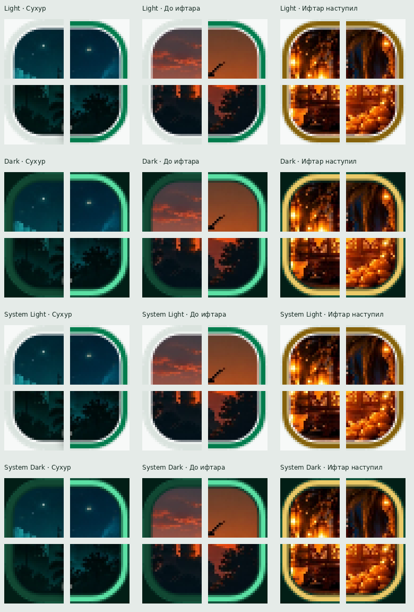
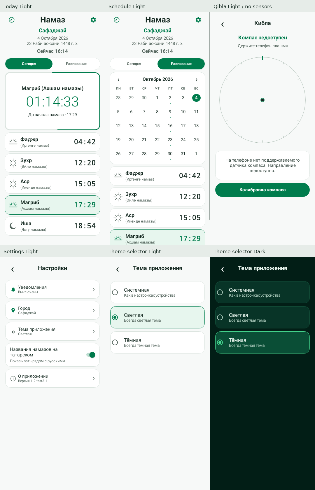
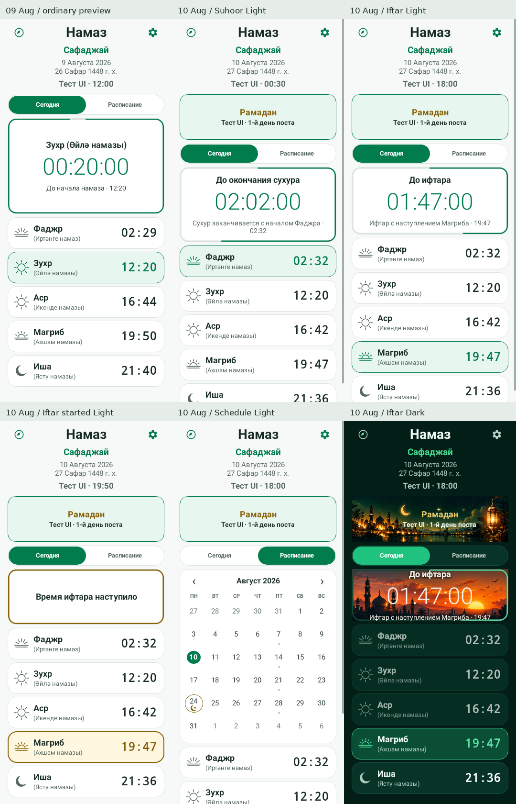

# Три темы и тестовый Ramadan UI

Репозиторий: `namaz-vakytylary/Namaz-Safadzhay-2026`.
Единственная изменяемая ветка: `test/1.2-test3-security`.
Исходный коммит: `a7d46f43596b6b776151e9d9fdf64cc4e8a69a44`.

## Финальный арт для наступившего ифтара

Проверка продолжает актуальную ветку с коммита `0f1cba34fae7307a8eab67d8d17290f9a0445472`: пользователь загрузил окончательную композицию и переименовал её в `ramadan_iftar_started.webp`. Используется именно этот финальный арт из проекта. Выполнено только пропорциональное уменьшение всего изображения (Lanczos) с 1983×793 до 1200×480 и сохранение WebP с quality 92. Элементы не перемещались, исходный фон не обрезался и текст в изображение не добавлялся. Размер уменьшился с 334112 до 161490 байт; SHA-256 результата `eb82f580191b841367c156f1082b9123faaa7ae8b591cccac4fdd7e4838b4d7b`.

| Состояние | Resource |
|---|---|
| Постоянный Ramadan banner | `R.drawable.ramadan_header` |
| До окончания сухура | `R.drawable.ramadan_suhoor` |
| До ифтара | `R.drawable.ramadan_iftar` |
| Время ифтара наступило | `R.drawable.ramadan_iftar_started` |

Один и тот же drawable наступившего ифтара используется в Light, Dark, System+Android Light и System+Android Dark, только в соответствующем состоянии. Существующий `CENTER_CROP` одинаково масштабирует обе оси и центрирует изображение внутри карточки 3:1. Остальные состояния сохраняют `FIT_CENTER`.

Код приложения в этом изменении побайтно сохранён: `MainActivity`, `RamadanCountdownImageView`, маска clipping, `CardProgressIndicator`, геометрия, порядок слоёв, светлый заголовок и его чёрная тень не менялись. Золотой stroke остаётся полностью видим поверх artwork.

Через Robolectric native graphics (API 33) проверены 10.08.2026, 19:50 при Магрибе 19:47 во всех четырёх конфигурациях. В окончательной отрисовке мечеть и полумесяц расположены ниже заголовка; за надписью находится спокойное тёмное небо. Полумесяц виден, текст читается. Пропорции/crop проверены по Android image matrix; просмотрены все 16 углов after-Iftar при увеличении ×4. Автоматические проверки alpha каждого пикселя вне внутреннего контура прошли, включая четыре плотности и два размера.

Дополнительно проверены все 12 комбинаций трёх Ramadan-состояний и четырёх конфигураций темы. Восемь экранов сухура/ожидания ифтара пиксель в пиксель совпадают с предыдущей версией. Четыре after-Iftar экрана изменяются только внутри countdown card; внешний UI, верхний баннер и активная карточка Магриба идентичны прежним. System Light/Dark полностью совпадают с соответствующими явными темами. Финальный фон визуально отличается от постоянного баннера.

Debug APK собран; 79 debug и 79 release unit tests прошли без failures/errors/skipped. Lint: 0 errors; debug 62 warnings, release 63 warnings (дополнительный `GradleDependency` сообщает о новой версии неизменённой `androidx.core:core-ktx`; зависимости не обновлялись). Preflight и 7 Python security tests прошли; все 1530 исходных времён намазов неизменны. Искусственная дата `2026-08-10` присутствует только в debug fixture и отсутствует в скомпилированном release-классе. APK содержит точные байты оптимизированного drawable, подпись debug валидна.

Физического устройства/эмулятора нет: instrumentation-проверка на устройстве не выполнялась. Реальные даты, расписания, preview fixture, theme settings, signing и security не модифицированы. Изменения записываются только в `test/1.2-test3-security`; app `main` и `namaz-schedules` не затронуты.

Файлы текущего изменения:

```text
app/src/main/res/drawable/ramadan_iftar_started.webp
verification/THEME_RAMADAN_CHECK.md
verification/theme-ui/ramadan.webp
verification/theme-ui/ramadan-corners.webp
```

## Исправление clipping Ramadan countdown

Актуальная проверка продолжает ветку с коммита `061c4d6313122e13200d098bfc88b7c31019f6c1`.

Причина: `countdownCard.clipToOutline` ограничивал фон только внешним контуром карточки. Progress border рисуется с отступом внутрь, поэтому изображение оставалось снаружи stroke и выступало в углах.

`RamadanCountdownImageView.kt` добавляет отдельный `Canvas.clipPath` только для artwork. Кэшируемая маска пересчитывается при изменении размера и следует внутреннему контуру существующего индикатора: stroke 2.5dp, centre inset 2.25dp, внутренний отступ 3.5dp, внутренний радиус 14.5dp при обычных размерах. Дополнительный запас 1 физический пиксель удерживает полупрозрачное сглаживание углов внутри stroke. Он изменяет только маску изображения, а не размер ImageView, карточки или рамки.

На этапе исправления clipping в `MainActivity.kt` менялся только тип ImageView для countdown; размеры, текст, padding и порядок слоёв были сохранены. Последующее изменение crop для подготовленного after-Iftar artwork описано выше. Верхний Ramadan banner не менялся. `DesignViews.kt`, включая весь `CardProgressIndicator`, побайтно совпадает с исходным коммитом: прогресс, направление, цвета, толщина, форма и вычисление по оставшемуся времени не модифицированы.

Проверены сухур, ожидание ифтара и наступивший ифтар в Light, Dark, System+Android Light и System+Android Dark — 12 комбинаций, включая все 9 запрошенных. Автоматическая проверка каждого пикселя отдельного слоя изображения не допускает ненулевой alpha вне внутреннего контура. Все 48 углов дополнительно просмотрены при увеличении ×4. Новый тест `artworkClipRespectsInnerBorderAcrossDensitiesAndSizes` проверяет три исходных фона при mdpi/hdpi/xhdpi/xxxhdpi и двух размерах — ещё 24 комбинации, также в release unit tests.

Сравнение 12 полных экранов с отрисовкой до clipping: изменения строго внутри countdown card, центральные области с artwork/text и все пиксели вне карточки идентичны. Верхний banner, размеры и расположение UI сохранены. Золотой стиль после ифтара сохранён.

Проверки: debug APK собран; 79 debug и 79 release unit tests прошли без failures/errors/skipped. Lint в обоих вариантах: 0 errors / 62 warnings, без новых предупреждений. Preflight и 7 Python security tests прошли; все 1530 исходных времён намазов неизменны. Debug fixture и release source set побайтно сохранены; искусственная дата и `TEST_RAMADAN_START_DATE` отсутствуют в скомпилированном release-классе.

Отрисовка выполнена через Robolectric native graphics, API 33. Устройства/эмулятора нет, instrumentation-проверка на устройстве не выполнялась.

Файлы исправления clipping:

```text
app/src/main/java/ru/namaz/safadzhay/MainActivity.kt
app/src/main/java/ru/namaz/safadzhay/RamadanCountdownImageView.kt
app/src/test/java/ru/namaz/safadzhay/ThemeAndRamadanTest.kt
verification/THEME_RAMADAN_CHECK.md
verification/theme-ui/ramadan.webp
verification/theme-ui/ramadan-corners.webp
```



## Реализация

- `AppTheme.kt`: режимы System/Light/Dark, семантическая палитра. Все прежние тёмные значения сохранены; геометрия обычных экранов не менялась.
- Светлая тема использует фон `#F7F9F8`, белые поверхности, тёмный текст, зелёный `#007C4D`, лёгкую границу и светлое выделение активной карточки. Контраст текста и зелёных подписей проверен автоматически.
- `ThemeSettings` сохраняет только `app_theme` в существующем SharedPreferences `settings`; default и неизвестное значение — System. Город, уведомления, звук и татарские названия не сбрасываются.
- System читает `Configuration.UI_MODE_NIGHT_MASK`. Android пересоздаёт Activity при смене системной темы; явные Light/Dark игнорируют этот режим. Выбор темы также пересоздаёт Activity, сохраняя дату, месяц, вкладку, открытый экран и диалог «О приложении».
- «Настройки → Тема приложения» открывает существующее полноэкранное окно настроек с тремя radio-вариантами и требуемыми подписями.
- Цвета применены к обычным экранам, календарю, уведомлениям, выбору города, компасу и диалогам. WindowCompat управляет светлыми/тёмными системными иконками; на Android 6/7 светлая тема использует тёмную navigation bar для белых системных иконок. Автоматический Force Dark отключается только на поддерживаемых API.
- Ramadan artwork не зависит от темы: Light, Dark и System используют существующие `ramadan_header`, `ramadan_suhoor`, `ramadan_iftar`, `ramadan_iftar_started`. Текст поверх изображений имеет постоянные светлые/золотистые цвета; окружающие поверхности и выделение Магриба используют выбранную палитру. Изображения, размеры блоков и расположение текста сохранены как в Dark.

## Исправление Ramadan artwork в Light

Исправление продолжает актуальную тестовую ветку с коммита `811236cebbe51deaf5aee36e50ba7c275693230c`.

Причина исчезновения изображений: создание баннера и три состояния countdown скрывали ImageView при `!palette.isDark`. Дополнительный Light-блок заменял цвета текста и высоту карточки ифтара. Условия удалены: видимость artwork теперь определяется состоянием Рамадана. В `AppColors` выделены постоянные цвета заголовка и подписей поверх изображения, соответствующие прежним Dark-значениям.

На этапе восстановления artwork четыре исходных WebP-файла не менялись; впоследствии пользователь заменил только `ramadan_iftar_started.webp` в коммите `c248d47`, и текущий UI использует эту подготовленную версию. Копии для Light не создавались. Нижняя карточка Магриба сохраняет существующий светлый золотистый вариант.

`ramadanLightDarkAndSystemScenes` расширен проверками видимости и исходного resource ID каждого фона, отсутствия color filter, размеров изображения и карточки, светлых подписей/таймера и золотистого выделения Магриба. Проверены три состояния 10.08.2026 в Light, Dark, System+Light и System+Dark — 12 комбинаций; 09.08 остаётся обычным режимом.

На этапе восстановления artwork в коммите `061c4d6` Dark Suhoor, before Iftar, after Iftar и Schedule полностью совпали с предыдущей отрисовкой. Последующее исправление clipping выше намеренно меняет только границу artwork внутри countdown в обеих темах. Контактная таблица ниже показывает актуальные три состояния в Light и Dark; это реальные Android Views, отрисованные через Robolectric native graphics.

Повторная проверка исправления: `assembleDebug`, все 78 debug и 78 release unit tests, `lintDebug` и `lintRelease` прошли. Lint: 0 errors / 62 warnings для каждого варианта, без роста относительно предыдущего коммита. Preflight проверил все 1530 исходных значений расписаний; 7 Python security tests прошли. В скомпилированном release-классе нет искусственной даты и `TEST_RAMADAN_START_DATE`; debug fixture и release-реализация не изменялись.

Файлы этого исправления:

```text
app/src/main/java/ru/namaz/safadzhay/AppTheme.kt
app/src/main/java/ru/namaz/safadzhay/MainActivity.kt
app/src/test/java/ru/namaz/safadzhay/ThemeAndRamadanTest.kt
verification/THEME_RAMADAN_CHECK.md
verification/theme-ui/ramadan.webp
```

Security, signing, реальные календарные данные и расписания не изменены. `main` приложения и `namaz-schedules` не изменяются этим исправлением.

## Искусственная дата — только debug

`app/src/debug/java/ru/namaz/safadzhay/RamadanUiPreview.kt` содержит `TEST_RAMADAN_START_DATE = "2026-08-10"` и 30-дневный UI fixture. Это не реальная дата Рамадана.

Debug APK: «Настройки → Проверка Рамадана». Доступны обычный день 09.08, сухур, дневной пост, ожидание ифтара и начало ифтара 10.08.2026, а также возврат к текущему времени устройства. Сцены замораживают только UI clock; время начала ифтара берётся из существующего расписания выбранного города плюс три минуты для сцены «ифтар наступил». Сами времена намазов не меняются. Заголовки показывают «Тест UI».

`app/src/release/java/ru/namaz/safadzhay/RamadanUiPreview.kt` — отдельная реализация: fixture недоступен, список сцен пуст, часы возвращают настоящее время, synthetic Ramadan day всегда null. Release не читает debug-настройку. Даже сохранённое `debug_ramadan_ui_scene` не включает подмену в release.

Нативные Android source sets исключают debug-файл из release-компиляции. Проверено содержимое скомпилированных классов: строка `2026-08-10` и имя `TEST_RAMADAN_START_DATE` присутствуют в debug `RamadanUiPreview.class` и отсутствуют в release-классе. Дата `2026-08-10` закономерно остаётся в настоящем списке дат расписания; этот список не изменялся.

Реальный `HolidayCalendar`, исламские даты, праздничные данные, источники обновлений и планировщики уведомлений не модифицированы. UI fixture не используется как fallback настоящей даты.

## Проверки

Проверено 2026-10-04, JDK 17, Gradle 8.10.2, Android SDK 35.

| Проверка | Результат |
|---|---|
| `:app:assembleDebug` | PASS; debug APK собран и подпись v1/v2 проверена |
| `:app:compileReleaseKotlin` | PASS; release-код скомпилирован |
| `:app:testDebugUnitTest` | 79 tests, 0 failures, 0 errors |
| `:app:testReleaseUnitTest` | 79 tests, 0 failures, 0 errors |
| `:app:lintDebug` / `:app:lintRelease` | PASS; 0 errors, 62 warnings в каждом варианте; lint не отключён |
| `scripts/preflight.py` | PASS, включая точные исходные таблицы обоих городов, 1530 времён |
| Python security tests | 7 tests, PASS |
| Compiled fixture isolation | PASS; искусственная дата исключена из release-класса |
| `:app:verifyReleaseSigning` без секретов | Ожидаемый отказ: `Release signing is not configured`; защита сохранена |
| `:app:connectedDebugAndroidTest` | Задача завершилась успешно; instrumentation-тестов и подключённого устройства нет, фактический запуск тестов на Android не выполнен |
| Native UI screenshots | 40 экранов + 24 слоя image/card + 24 density/size fixture renders; Robolectric native graphics, API 33 |

Подписанный release APK локально не создавался: signing inputs не предоставлены и не извлекались. CI сохраняет прежний защищённый шаг release-подписи и добавляет debug unit tests, lint и отдельный debug UI APK. GitHub Actions в этой сессии не запускался.

Снимки ниже — отрисовка настоящих Android Views через Robolectric, не скриншоты устройства/эмулятора. System-mode смена, выбор темы, перезапуск и сохранение настроек проверены Robolectric. Физические датчики, геолокация телефона, доставка уведомлений Android и фактический вид системных панелей на устройстве требуют проверки устройства. Цвета стрелки, Каабы и букв компаса дополнительно отрисованы с детерминированным heading/location fixture; отдельно проверен экран отсутствующих датчиков.

## Сценарии

| Сценарий | Результат |
|---|---|
| System + Android Light | Light, PASS |
| System + Android Dark | Dark, PASS |
| Light + Android Dark | Light, PASS |
| Dark + Android Light | Dark, PASS |
| Смена Android uiMode при открытых настройках | Тема обновляется, экран сохранён, PASS |
| Перезапуск и theme selector | Режим сохраняется, правильный radio отмечен, PASS |
| Город/уведомления/татарские названия/звук | Настройки сохраняются, PASS |
| Today/Schedule/Settings/Qibla/notifications/city/about/selector | Light/Dark отрисованы и проверены |
| Debug 09.08.2026 | Обычный UI, PASS |
| Debug 10.08.2026 | Первый искусственный день Рамадана, PASS |
| Ramadan Light / Dark | Сухур, ожидание ифтара, начало ифтара, календарь, PASS |
| Ramadan System + Android Light/Dark | Соответствующая палитра, PASS |
| Debug UI clock и notification scheduler | Scheduler использует настоящую дату; подпись настроек не меняется, PASS |
| Release с сохранённой debug-настройкой | Настоящие часы, fixture не включается, PASS |
| Настоящий Ramadan 19.02–19.03.2026 | Исходная логика сохранена и проверена |

Новые проверки находятся в `ThemeAndRamadanTest.kt` (15 тестовых методов для обоих вариантов) и `scripts/test_theme_security.py` (3 проверки изоляции и сохранения CI/signing gates). Существующие regression, notification, calendar, schedule validation/cache, update checker, compass math и font-scale тесты прошли.

## Снимки отрисовки





Полный комплект воспроизводится unit-тестами в `app/build/reports/theme-ui`; CI сохраняет эту папку как verification artifact.

## Файлы начального внедрения тем и debug fixture

```text
.github/workflows/build-apk.yml
app/src/debug/java/ru/namaz/safadzhay/RamadanUiPreview.kt
app/src/main/java/ru/namaz/safadzhay/AppTheme.kt
app/src/main/java/ru/namaz/safadzhay/DesignViews.kt
app/src/main/java/ru/namaz/safadzhay/MainActivity.kt
app/src/main/java/ru/namaz/safadzhay/UiPreviewScene.kt
app/src/main/res/values/colors.xml
app/src/main/res/values/themes.xml
app/src/release/java/ru/namaz/safadzhay/RamadanUiPreview.kt
app/src/test/java/ru/namaz/safadzhay/ThemeAndRamadanTest.kt
scripts/test_theme_security.py
verification/THEME_RAMADAN_CHECK.md
verification/theme-ui/ordinary.webp
verification/theme-ui/ramadan.webp
```

`app/build.gradle.kts`, AndroidManifest, исходные расписания, реальные праздники, signing scripts/credentials, backup flags и validation/cache/security-код сохранены. `main` и `namaz-schedules` не изменялись в рамках этой задачи. Merge и PR не создавались.
